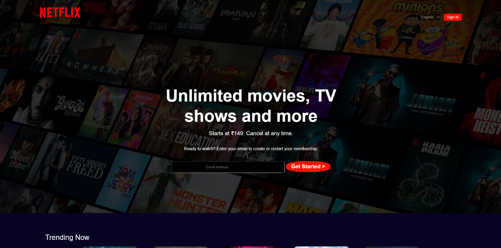

# 🎬 Netflix Landing Page Clone

A responsive Netflix landing page clone built using **HTML** and **CSS**. This project is purely front-end and focuses on recreating the look and feel of the original Netflix homepage.

## 🌐 Live Demo

[Click here to view the live site](https://shrijan18.github.io/Netflix_Clone/)  


## 📸 Screenshots

  


## 🛠️ Tech Stack

- HTML5
- CSS3
- (Optional: You can mention Flexbox, Grid, Media Queries)

<pre> ## 📁 Folder Structure ``` netflix-clone/ ├── images/ ├── index.html ├── README.md └── style.css ``` </pre>